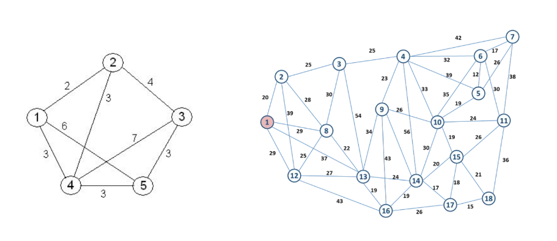

## Descrição do desafio

Resolver os dois problemas na força bruta e medir o tempo de resolução

## Resolução
As resoluções estão nos arquivos grafo_01.py e grafo_02.py. O grafo 01 foi executado com êxito, porém o grafo 02 na minha máquina e por força bruta foi impossivel com o número de possibilidades, só foi possivel encontrar o caminho com 13 vértices no máximo.