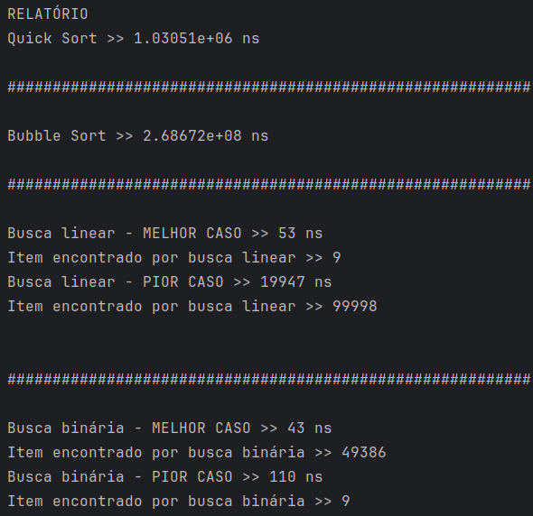

# Questões

Faça o seguinte algoritmo:

- [x] 1 - Gerar uma sequência aleatória de 10000 números - S
- [x] 2 - Ordenar S de duas formas diferentes. Usar o quick sort e buble sort.
- [x] 3 - Medir o desempenho de cada algoritmo de ordenação
- [x] 4 - Construir dois algoritmos de busca: linear e binária
- [x] 5 - Medir o desempenho do algoritmo de busca no melhor e pior caso - OK

Gera um relatório técnico sobre os resultados

