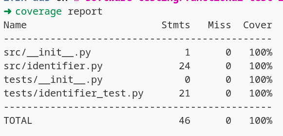

# Teste de Software

## Especificações da atividade

Considerando o exemplo utilizado na atividade da técnica de teste funcional (identifier), liste casos de teste para ser aplicado o teste estrutural. Liste casos de teste que consigam atingir a maior cobertura de código possível. Apresente o relatório de cobertura de código utilizando uma ferramenta como o Coverage, apresentado durante a aula.

### Lista de casos de teste - Entrada - Cobertura na classe identifier
| **Caso de teste** | **Entrada** | **Cobertura** |
|:---:|:---:|:---:|
| test_should_return_false_when_the_user_inputs_an_empty_string | "" | 33% |
| test_should_return_true_when_the_user_inputs_an_valid_string | "stdlib" |83% |
| test_should_return_false_when_the_user_starts_the_string_with_a_number | "1" | 54% |
| test_should_return_true_when_the_user_starts_with_capital_letter | "A564" | 83% |
| test_should_return_true_when_the_user_starts_with_a_letter_and_number | "a7" | 83% |
| test_should_return_true_when_the_string_has_a_single_letter | "S" |54% |
| test_should_return_false_when_the_string_starts_with_special_characters | "/**~'" | 88% |
| test_should_return_false_when_string_size_is_greater_than_six | "abcdefg" | 83% |

### Maior cobertura
| **Caso de teste** | **Entrada** | **Cobertura** |
|:---:|:---:|:---:|
| test_should_return_true_when_the_user_inputs_an_valid_string | "stdlib" |83% |
| test_should_return_true_when_the_user_starts_with_capital_letter | "A564" | 83% |
| test_should_return_true_when_the_user_starts_with_a_letter_and_number | "a7" | 83% |
| test_should_return_false_when_the_string_starts_with_special_characters | "/**~'" | 88% |
| test_should_return_false_when_string_size_is_greater_than_six | "abcdefg" | 83% |

> OBS: Esse texto na coluna de **Caso de teste** refere-se ao nome da função do teste.

### Coverage image
